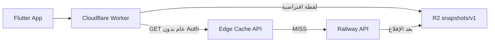

# Cloudflare Edge Speed (Package D)

تسريع تحميل البيانات العامة عبر **Cloudflare Worker** (كاش Edge + لقطات JSON على R2) مع الإبقاء على **Railway** كمصدر الحقيقة.

## البنية



| المسار | الوظيفة |
|--------|---------|
| `https://…workers.dev/railway/*` | بروكسي لـ Railway — يُخزَّن GET العام في كاش Edge |
| `https://…workers.dev/snapshots/v1/*` | JSON ثابت من R2 (أسرع مسار للكتالوج الافتراضي) |
| `https://…workers.dev/auth/*` | OTP (كما كان) |
| `https://…workers.dev/media/*` | صور R2 (كما كان) |

## ما يُخزَّن على Edge (GET فقط، بدون `Authorization`)

- `/db/shopping-stores` (بدون `subCategoryId`)
- `/db/restaurant-stores` (بدون `subCategoryId`)
- `/db/catalog-products` (بدون فلاتر)
- `/db/offer-catalog-products`
- `/db/marketplace-stats`
- `/app/home-categories`
- `/app/update-policy`
- `/app/maintenance`
- `/app/edge-manifest`
- `/health`

طلبات **POST/PUT/DELETE** أو أي طلب مع **Bearer token** تمر مباشرة إلى Railway **بدون كاش**.

## النشر

### 1) Worker

```powershell
$env:CLOUDFLARE_API_TOKEN = "YOUR_TOKEN"
.\scripts\deploy-worker.ps1
```

اختياري — تأكيد أصل Railway:

```powershell
npx wrangler secret put RAILWAY_API_ORIGIN
# القيمة: https://alghaith-app-production.up.railway.app
```

### 2) Railway — متغيرات R2 (لنشر اللقطات)

في `backend/.env` / Railway Variables:

```
R2_ACCOUNT_ID=...
R2_ACCESS_KEY_ID=...
R2_SECRET_ACCESS_KEY=...
R2_BUCKET_NAME=alghaith-images
R2_PUBLIC_BASE_URL=https://lively-wind-9d98.alghaithapp.workers.dev
ENABLE_EDGE_SNAPSHOTS=true
```

ثم:

```powershell
.\scripts\deploy-backend-railway.ps1
```

بعد الإقلاع، السيرفر يُسخّن الكاش ثم ينشر `snapshots/v1/*.json` إلى R2.

### 3) التطبيق (إصدار جديد)

الافتراضي في `AppConfig` أصبح:

```
https://lively-wind-9d98.alghaithapp.workers.dev/railway
```

للعودة المؤقتة إلى Railway مباشرة عند البناء:

```bash
flutter build apk --dart-define=DATABASE_BACKEND_BASE_URL=https://alghaith-app-production.up.railway.app
```

## دومين مخصص (اختياري — أقوى أداء من العراق)

1. في Cloudflare DNS: `api.alghaithst.com` → Worker route (`lively-wind-9d98`)
2. Worker Routes: `api.alghaithst.com/*`
3. Cache Rules (لوحة Cloudflare):
   - **Cache**: URL يحتوي `/railway/db/` أو `/railway/app/home-categories` — **Eligible**
   - **Bypass**: Header `Authorization` موجود
4. حدّث `DATABASE_BACKEND_BASE_URL` إلى `https://api.alghaithst.com/railway`

## التحقق

```powershell
# لقطة من R2 (بعد نشر Railway مع R2)
Invoke-WebRequest "https://lively-wind-9d98.alghaithapp.workers.dev/snapshots/v1/home-categories.json"

# بروكسي مع كاش Edge
$r1 = Invoke-WebRequest "https://lively-wind-9d98.alghaithapp.workers.dev/railway/app/home-categories"
$r1.Headers["X-Edge-Cache"]  # MISS ثم HIT

# طلب مصادق — لا كاش
Invoke-WebRequest "https://lively-wind-9d98.alghaithapp.workers.dev/railway/db/customer-profile?phone=..." -Headers @{ Authorization = "Bearer TOKEN" }
```

## Redis (اختياري)

لتشارك الكاش بين نسخ Railway المتعددة:

```
REDIS_URL=redis://...
```

راجع `backend/lib/response_cache.js`.

## ملاحظات

- اللقطات تُحدَّث عند كل إقلاع سيرفر (ويمكن لاحقاً ربطها بـ webhook عند تعديل الأدمن).
- فلاتر `subCategoryId` / `category` لا تستخدم اللقطة — تمر عبر البروكسي + كاش Edge حسب URL كامل.
- لا تضع `Authorization` في مسارات عامة؛ الكاش مصمم لتجاهلها تلقائياً.
