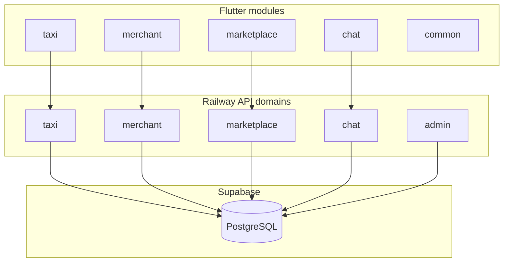

# البنية المعيارية لتطبيق الغيث

> هدف هذا المستند: منع تحوّل المشروع إلى «كود سباغيتي» مع نمو الخدمات (مطاعم، بازار، عقارات، تكسي، توصيل، دردشة، إشعارات، إدارة…).

التطبيق يقترب من منصات مثل **Careem / Grab / GoTo**. الحل ليس Microservices فوراً، بل **Modular Monolith** — وحدات واضحة داخل نفس المشروع، قابلة للفصل لاحقاً.

---

## 1. Flutter — `lib/modules/`

### المبدأ

كل **مجال أعمال** (Domain) يملك مجلداً مستقلاً:

```
lib/modules/<domain>/
├── models/
├── providers/      # أو bloc/cubit
├── services/       # API خاص بالمجال فقط
├── screens/
├── widgets/
├── utils/          # اختياري
├── <domain>_module.dart   # واجهة عامة (exports)
└── README.md       # ما يملكه المجال + خطة النقل
```

### الوحدات

| الوحدة | الحالة | ملاحظات |
|--------|--------|---------|
| `taxi` | **منقول بالكامل** | كان `features/taxi` |
| `auth` | Scaffold | تسجيل OTP، جلسة، ضيف |
| `marketplace` | **منقول** | رئيسية، سلة، متاجر، `customer_service` |
| `restaurants` | **منقول جزئياً** | يعيد تصدير قوائم المطاعم من `marketplace` |
| `merchant` | **منقول** | لوحة التاجر + merchant_service |
| `courier` | **منقول** | التوصيل + delivery_service |
| `auth` | **منقول** | تسجيل الدخول والجلسة |
| `admin` | **منقول** | لوحة الإدارة داخل التطبيق |
| `driver` | **منقول** | قشرة السائق + `driver_service` |
| `real_estate` | **منقول** | عقارات — قوائم ونماذج |
| `chat` | **منقول** | محادثات داخلية |
| `notifications` | **منقول** | FCM + hub + بانرات |
| `admin` | Scaffold | إدارة داخل التطبيق |
| `common` | **منقول** | شاشات الحساب + بنية تحتية مشتركة |
| `wallet` | **مستقبلي** | مدفوعات |

### الاستيراد

```dart
import 'package:alghaith_app/modules/taxi/taxi_module.dart';
import 'package:alghaith_app/modules/modules.dart'; // barrel اختياري
```

التوافق القديم: `lib/features/taxi.dart` (مهمل — يعيد التصدير من `modules/taxi`).

### ترتيب النقل الموصى به

1. ~~taxi~~ (تم)
2. ~~merchant + courier~~ (تم)
3. ~~`admin` + `auth`~~ (تم)
4. ~~`marketplace` + `restaurants`~~ (تم)
5. ~~`chat` + `notifications`~~ (تم)
6. **أخيراً:** استكمال تقسيم `AppProvider` (حالة التنقل، الواجهة، الإشعارات، السلة، الطلبات — تم)

### ما يبقى عالمياً

- `lib/core/` — ثيم، config، `ApiClient`
- `main.dart` — تسجيل الـ providers فقط

---

## 2. Backend — `backend/domains/`

### المبدأ

نفس فكرة الوحدات، لكن على السيرفر. **مسارات HTTP لم تتغير** — التطبيق واللوحة يستمران باستدعاء `/db/taxi`, `/db/chat`, إلخ.

```
backend/domains/
├── registry.js          # يركّب كل المسارات + يشغّل workers
├── taxi/
│   └── index.js         # routes + repo + services + scheduler
├── merchant/
├── marketplace/
├── chat/
├── notifications/
└── ...
```

### الخدمات المنطقية

| Domain | Mount | المسؤولية |
|--------|-------|-----------|
| **Auth Service** | `/auth` | OTP، إصدار الجلسة |
| **User Service** | `/db` | ملفات، عناوين، مفضلة، طلبات زبون |
| **Merchant Service** | `/db` | متاجر، منتجات، طلبات واردة |
| **Marketplace Service** | `/db` | قوائم عامة (قراءة فقط) |
| **Delivery Service** | `/db` | مندوبو التوصيل |
| **Taxi Service** | `/db/taxi` | رحلات، تسعير، مطابقة سائق |
| **Chat Service** | `/db/chat` | محادثات |
| **Voice Service** | `/db/voice` | مكالمات Zego |
| **Notification Service** | (workers) | FCM، جدولة push |
| **Admin Service** | `/db` | موافقات، تقارير، إعدادات منصة |
| **Platform Service** | `/app`, `/maps` | تحديث إجباري، خرائط |
| **Payment Service** | — | **لاحقاً** (wallet) |

`server.js` أصبح رفيعاً:

```js
const { mountDomainRoutes, startDomainWorkers } = require('./domains/registry');
mountDomainRoutes(app);
// ...
startDomainWorkers();
```

**سياسات البيانات والبنية التحتية** (JSON vs جداول، R2، طابور إشعارات، كاش محلي): [`DATA_AND_INFRA_ARCHITECTURE.md`](./DATA_AND_INFRA_ARCHITECTURE.md).

### متى Microservice؟

عندما يكبر مجال واحد (مثلاً التكسي):

1. انسخ `domains/taxi/` إلى مشروع Node منفصل
2. أبقِ نفس مسارات الـ API خلف reverse proxy
3. بقية المجالات تبقى في Monolith

لا حاجة لإعادة كتابة Flutter أو لوحة الإدارة.

---

## 3. مخطط العلاقات



---

## 4. قواعد للمطورين

1. **كود جديد** يذهب إلى `modules/<domain>/` وليس `screens/` الجذر.
2. **API جديد** يُعرَّف في `domains/<name>/` ويُسجَّل في `registry.js`.
3. لا تستورد وحدة من وحدة أخرى إلا عبر `*_module.dart` العام.
4. `AppProvider` لا يكبر — أضف provider داخل الوحدة.
5. لا تنشر من جذر المستودع على Railway — استخدم `scripts/deploy-backend-railway.ps1`.

---

## 5. المراجع

- Flutter: [`lib/modules/README.md`](../lib/modules/README.md)
- Backend: [`backend/domains/README.md`](../backend/domains/README.md)
- نشر Railway: [`AGENTS.md`](../AGENTS.md) → Railway backend deployment
